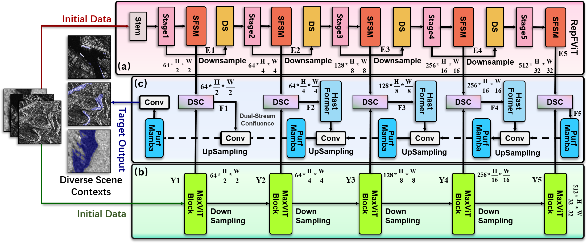

# xxxxxxxxxxxxxxxxxxxxxxxxxxxxxxxx

### [Project page](https://github.com/IMOP-lab/Depo-Net) | [Our laboratory home page](https://github.com/IMOP-lab) 

  

  Figure 1: Detailed network structure of the Depo-Net.

## Installation
Initial learning rates are uniformly set at 0.0001, with batch sizes standardized to 2 across all models.  Experimental evaluations are conducted within a consistent hardware and software environment, featuring a workstation equipped with dual NVIDIA RTX 4080 Super GPUs, an AMD Ryzen R9-5950X processor, and 128GB RAM.  The experimental framework is structured in Python 3.9, employing PyTorch 2.0.0 and CUDA 11.8 for computational acceleration.

## Experiment
### Datasets
1.SARBuD 1.0 \url{https://github.com/CAESAR-Radi/SARBuD}.

2.HRSID \url{https://github.com/chaozhong2010/HRSID}.

3.FRBS \url{https://drive.google.com/file/d/15WYzzFZvAHmqSIW0PXXRTp_YVd_868l8/view}.

### Baseline
We provide GitHub links pointing to the PyTorch implementation code for all networks compared in this experiment here, so you can easily reproduce all these projects.

[U-Net](https://github.com/milesial/Pytorch-UNet);[ENet](https://github.com/davidtvs/PyTorch-ENet);[SegNet](https://github.com/vinceecws/SegNet_PyTorch?tab=readme-ov-file);[ICNet](https://github.com/hszhao/ICNet);[LEDNet](https://github.com/sczhou/LEDNet);[MRUNet](https://github.com/cyan-utokyo/MRUnet.git);[DconnNet](https://github.com/Zyun-Y/DconnNet);[PSPNet](https://github.com/hszhao/PSPNet.git);[UNet+Att](https://github.com/EvilPsyCHo/Attention-PyTorch.git);[PAttUNet](https://github.com/faresbougourzi/PDAtt-Unet);[DAttUNet](https://github.com/faresbougourzi/PDAtt-Unet);[DANet](https://github.com/junfu1115/DANet);[R2U-Net](https://github.com/ncpaddle/R2UNet-paddle); [Attention R2UNet](https://github.com/LeeJunHyun/Image_Segmentation);[poly pvt](https://github.com/DengPingFan/Polyp-PVT.git);[BAT](https://github.com/sharkdp/bat.git);[MDViT](https://github.com/siyi-wind/MDViT.git);[TransUNet](https://github.com/Beckschen/TransUNet.git);[UNeXt](https://github.com/jeya-maria-jose/UNeXt-pytorch.git);[TransFuse](https://github.com/Rayicer/TransFuse.git);[MambaHSI](https://github.com/li-yapeng/MambaHSI.git).

### Results
Table 1: The segmentation results of Depo-Net are compared with previous models on three SAR datasets (SARBuD, HRSID, FRBS), presented in three tables. The highest score for each metric is highlighted in red, while the second-best score is highlighted in blue. Segmentation models are detailed by method categories, with the best result within each category also highlighted in blue.

  

   Segmentation results are presented on SARBuD data.

  

   Segmentation results are presented on HRSID data.

  

   Segmentation results are presented on FRBS data.

#### Segmentation Results
A visual comparison of Depo-Net and other segmentation models is conducted across three SAR datasets. Five representative images are selected from each dataset for display. In these images, the segmentation results for target objects are filled in green, while the ground truth is outlined in red. Panel (a) represents the original image, {(b)-(g)} present the best segmentation results from each method category across the datasets, as shown in Table.\ref{tab: Buliding}. Specifically, (b) represents the best-performing model based on CNN methods across the three datasets, (c) represents the best-performing model based on CNN with attention mechanisms, and so on for the remaining categories, and (h) represents the segmentation result of Depo-Net.

  

    Figure 2:Visual segmentation results

